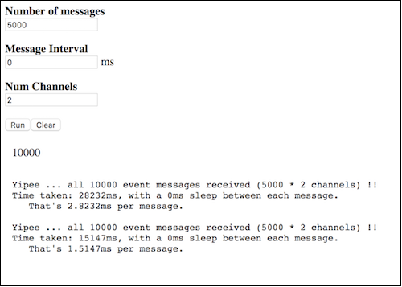

Load tester for the SSE Gateway plugin.

This load tester is a Jenkins plugin.

## Starting the plugin

Just run `mvn hpi:run` in this folder.

## Headless Run

This test exercises the "headless" SSE client (which uses the `EventSource` polyfill).

> __Note__: Disable Jenkins security.

From the root of this folder, run `npm run headless <num-messages> <interval> <num-channels>`.

e.g.

```
$ npm run headless 5000 0 5

Yipee ... all 25000 event messages received (5000 * 5 channels) !!
Time taken: 14276ms, with a 0ms sleep between each message.
   That's 0.57104ms per message.
```

## Browser Run

Tests browser clients and browser `EventSource` implementations.
 
Open `http://localhost:8080/jenkins/sse-gateway-load/` in the brwoser.




